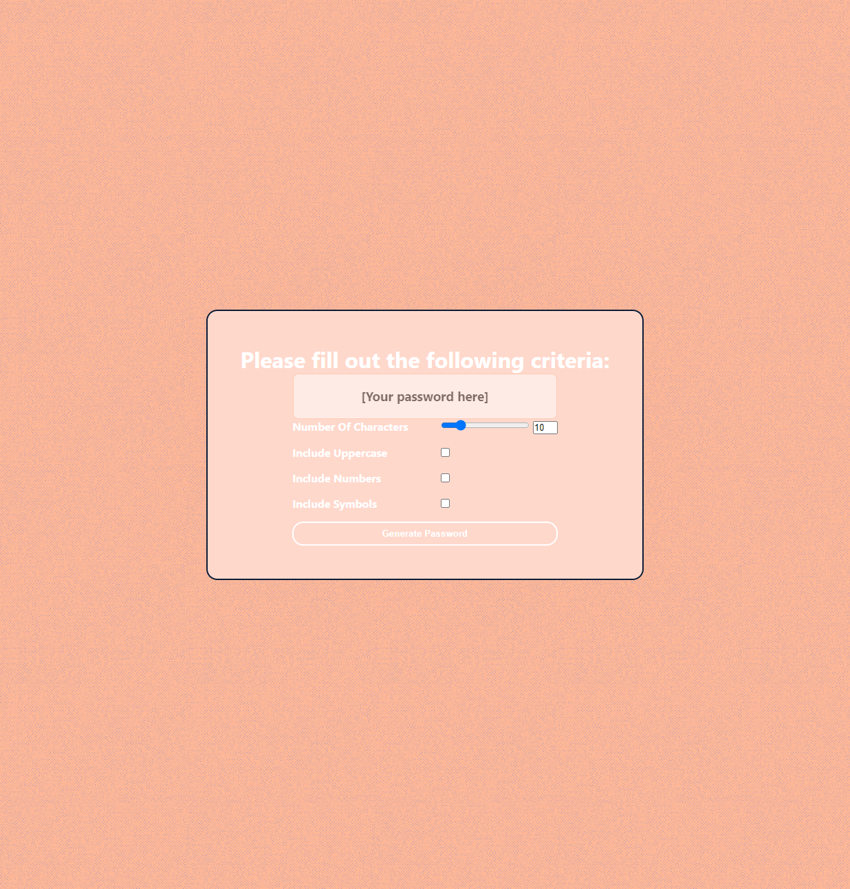

# 03-Homework-Password-Generator

# <Homework-Password-Generator>
## Description

- My motivation for this project was to create a functional password generator. I included a criteria section prior to password generation, for the user to signify if they wanted to include the following: numbers, symbols/special characters, and uppercase letters. The default is to include lowercase letters. I decided that, in place of browser prompts, a form would provide the user with a cleaner, more efficient, and overall pleasant experience. I wanted to create a user interface that was pleasant, simple, and straightforward, while still ensuring all necessary criteria was present for accurate password generation. I ensured that the minimum character length for the password was 8 characters and the maximum length would be 128 characters. The generated password is then displayed to the user immediately via the password display box. Currently working on adding addition aesthetic features, in addition to the color scheme found on the page; these "coming soon" features for the deployed application include a welcome screen, with a short timer, upon loading the page, as well as an animation for the generate password button to display each time it is clicked/submitted by the user. 

## Table of Contents (Optional)
If your README is long, add a table of contents to make it easy for users to find what they need.
- [Installation](#installation)
- [Link](#link)
- [Screenshot](#screenshot)
- [Credits](#credits)
- [License](#license)
## Installation
Ensure to link the style.css file and script.js file within the index.html file in order to apply styling/js function to the presented html code when viewing in browser. Make sure that index.html and assets folder are siblings of one another within the project folder. Next recheck that the css folder, containing style.css, images folder, containing the png and gif files, and js folder, containing the script.js file, are siblings of one another within the assets folder.

## Link
Link to deployed application:

https://yinzhedy.github.io/03-Homework-Password-Generator/

## Sceenshots

The following image demonstrates the web application's appearance and functionality:

## Credits
- Jack H. Ault
- https://github.com/henlowgg
## License
Unlicensed

## How to Contribute
Any requests for contribution please contact at yinzhe.dy@gmail.com
